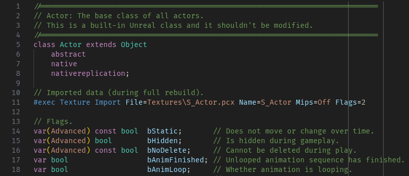
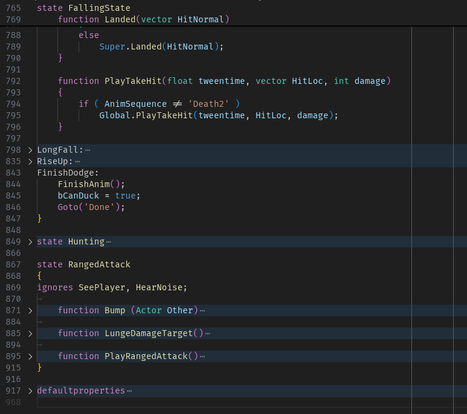
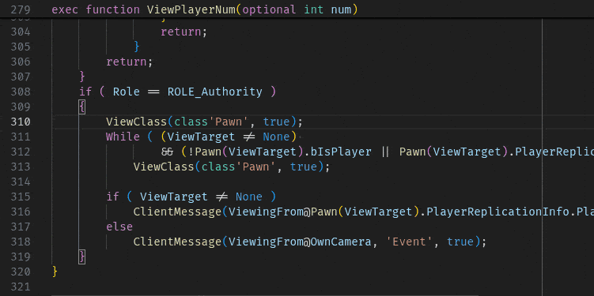
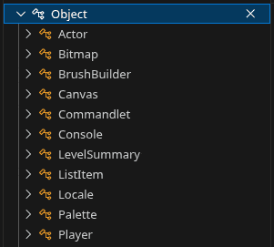
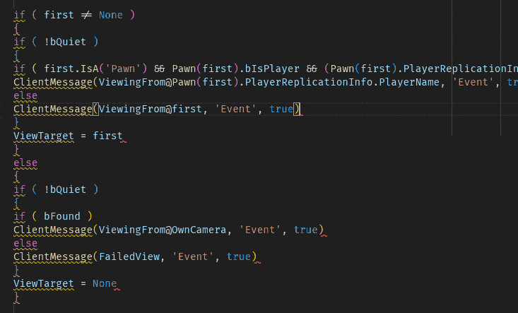

# UCX (Unreal Script Extensions)

Dedicated language support and tooling for the UnrealScript language with 
primary focus on UT99 (Unreal Engine 1). The primary goal is to be able to 
work and maintain large UnrealScript projects by bringing modern IDE features
to an old programming language.

The language parser is architected to be robust and gracefully fall back when 
dealing with unknown situations. This means the parser will not crash when it
encounters unknown UnrealScript features but it will still report warnings and
errors.

## VsCode Features

### Syntax Highlighting

Syntax highlighting is done through both a textmate grammar file and
semantic token highlighting is supported on top of that to provide the 
best possible syntax higlighting that is both fast and is done with the 
symbol type as identified by the grammar.

### Code Folding 

Defaultproperties, states, labels, replication, function inside state, 
labels inside states can be folded can all be independently. This also makes
the editor display which state you're currently editing at the top of the file
even if you're not scrolled to the beginning of the state.

### Code Navigation

The extension can find the definition and references for most symbols allowing
you to go to definition (`Ctrl-Click`), search through the symbols 
(`Ctrl-P @` and `Ctrl-P #` or `Ctrl-T`), find references.

### Completion

The extension will scan the current workspace and an optional library path to
provide code completion completion is supported in most situations.

### Class hierarcy

You can browse class hierarchy just like in unrealed. Right click a 
class name and select "Show Type Hierarchy". You can also show parents of
a class for reverse direction.

### Formatting

This extension supports code formatting. Documents or just selected regions
or changed code can be formatted depending on user configuration. 

The following features are supported and can be enabled/disable in user 
configuration if they are not needed.
- automatic indentation
- operator spacing
- keyword casing
- other spacing / newline rules
- remove redundant default properties
- semicolon completion

### Diagnostics

One of the goals is to early detect issues before compilation. Syntax errors,
missing semicolons and some other checks are reported. Additional typechecking
is work in progress.

- unused local variable are detected and reported as warnings
- function with missing return expression is also a warning
- when trying to use invalid chars inside name you get an error
- and more...

### Other IDE features/limitations

- rename symbols is supported but works well only for simple cases, for 
local variable definitions for example it works perfectly

- find definition works but can struggle on complex or rare use cases

- variable completion works for the most part but it does not check for type

- color picker is provided when defining color in default properties when
the color struct is detected

- find all references only works for simple cases but may have duplicates 
or missed references for now so I still find myself using grep

## CLI Features

 - lint command
    - runs all checks for given folder or file errors/warning messages inside 
    with file paths and syntax highlighting, great as automated check for PRs
 - build command
    - can be used build system for your unreal script projects
        - can auto generate ini file for build
        - copies files into temporary build folder
        - runs ucc build
    - language extensions
        - moves all code files into `Classes` subdir, this enables having folder 
        in sources for better project organization while flattening the structure
        so that its compatible with `ucc make`
        - basic constant folding
 - wrapper for any ucc command
    - path to UCC configured via env or cli argument
    - supports windows/linux/wine

## Installation

 - VsCode/Codium extension available
    - [Open VSX Registry](https://open-vsx.org/extension/peterekepeter/ucx)
    - [Visual Studio Marketplace](https://marketplace.visualstudio.com/items?itemName=peterekepeter.ucx)
 - Command line tool [avaliable via npm](https://www.npmjs.com/package/ucx) 
    - requires [nodejs](https://nodejs.org/en)
    - recommended install globally `npm i -g ucx@latest` 
        - may need sudo on linux
    - recommended env var `UCC_PATH=path_to_ut99/System/UCC.exe`

**Enjoy!**
